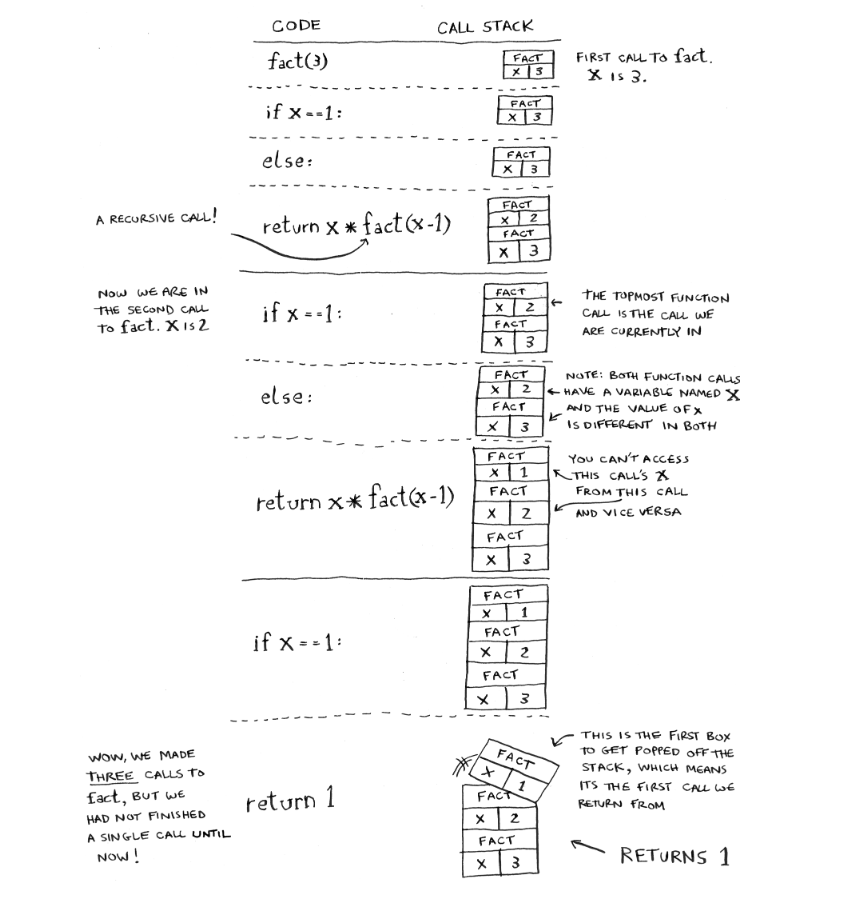
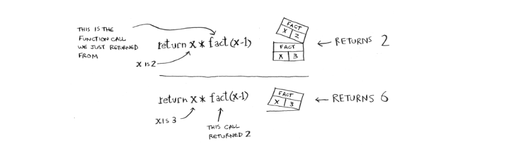

# Recursão

Recursão é quando uma função chama a si mesma.


>Vamos imaginar que você tem uma mala trancada. A chave da mala está dentro de uma caixa, entretanto, essa caixa tem várias caixas dentro (e a chave está dentro de alguma delas). Usando pseudocódigo, faríamos esse algoritmo para buscar:

```python
    def procure_pela_chave(caixa):
        for item in caixa:
            if(item.e_uma_caixa)
                procure_pela_chave(caixa)
            else
                print("Achei a chave") 
```

A recursão é usada para tornar a resposta mais clara.

- Dois conceitos são imporantes quando falamos em recursão: caso base e caso recursivo. Como a função recursiva chama a si mesma, é MUITO fácil acabar em loop infinito por erro de escrita. Toda função recursiva deve ter seu ponto de parada.

    - **Caso Base:** Este é o ponto de parada da recursão. É a condição em que a função recursiva não chama a si mesma novamente. Em vez disso, retorna um valor que não requer mais chamadas recursivas. Este caso é crucial para evitar um loop infinito na recursão e garantir que a função recursiva eventualmente termine.

    - **Caso Recursivo:** Este é o caso em que a função chama a si mesma com argumentos diferentes. A chamada recursiva permite que a função resolva um problema maior ou mais complexo dividindo-o em instâncias menores e mais simples do mesmo problema. Cada chamada recursiva avança em direção ao caso base, reduzindo progressivamente o problema até que o caso base seja alcançado.


**É como dividir um problema em subproblemas idênticos, até o caso base ser alcançado!**

## Call Stack (pilha de chamada)
    
A pilha de chamada funciona de acordo com o princípio LIFO(Last In, First Out).Assim, uma analogia útil é uma pilha de pratos : voce adiciona(push) um prato no topo da pilha e quando for remover(pop) voce remove o prato que está em cima. Em computação, essa estrutura de dados é utilizada para gerenciar as chamadas das funções.

- Quando uma função é chamada, ela é adicionada ao topo da pilha.
- Quando uma função termina de ser executada, ela é removida do topo da pilha, permitindo que a execução retorne à função que a chamou.
- Dessa forma, a função mais recentemente chamada é sempre a próxima a ser executada e removida da pilha.

> Se a pilha de chamada ficar muito grande devido a muitas chamadas de função aninhadas ou recursivas profundas, pode ocorrer um estouro de pilha (stack overflow), o que geralmente resulta em um erro no programa. Portanto, é importante escrever código de forma cuidadosa para evitar estouros de pilha.

> A grande ideia por trás da recursão é: quando você chama uma função a partir de outra, a chamada de função fica pausada em um estado parcialmente completo.

### Exemplo

Apesar de nesse repositório os códigos colocados serem recursivos, aqui vai um exemplo introdutório de como funciona a recursão e a call stack.

Imagine a seguinte função fatorial():
```
    public class Fatorial{
        public static int fatorial(int n){
            if(n == 1){
                return 1;
            }
            return n * fatorial(n - 1);
        }
    }

```

<p align="center">
  
  
</p>

    Recapitulando:
    - Recursão é quando uma função chama a si mesma.
    - Toda função recursiva tem dois casos: caso base e caso recursivo
    - Uma pilha tem duas operações: pop e push
    - Todas as chamadas de função vão para a pilha de chamada.
    - A pilha de chamada pode ficar muito grande e ocupar memória demais e até dar estouro.